# USER_FLOWS.md — Flujos de Secuencia

Notación: Mermaid `sequenceDiagram`. Renderizable en GitHub, Notion, y cualquier editor compatible.

---

## FLOW 01 — Registro y Verificación de Cuenta (Padre/Tutor)

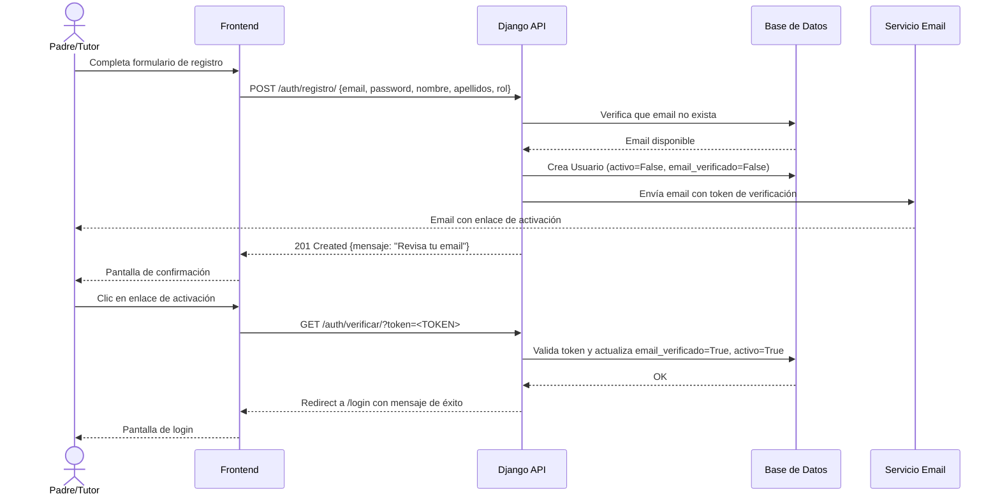

---

## FLOW 02 — Login y Generación de JWT

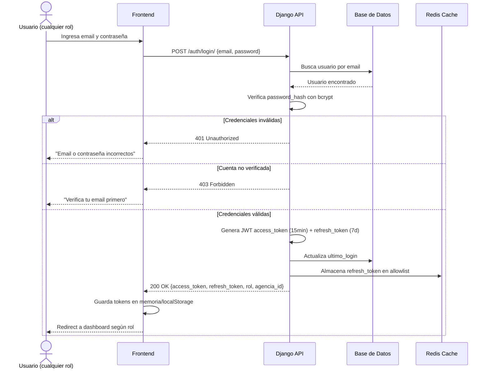

---

## FLOW 03 — Creación de Viaje (Agente)

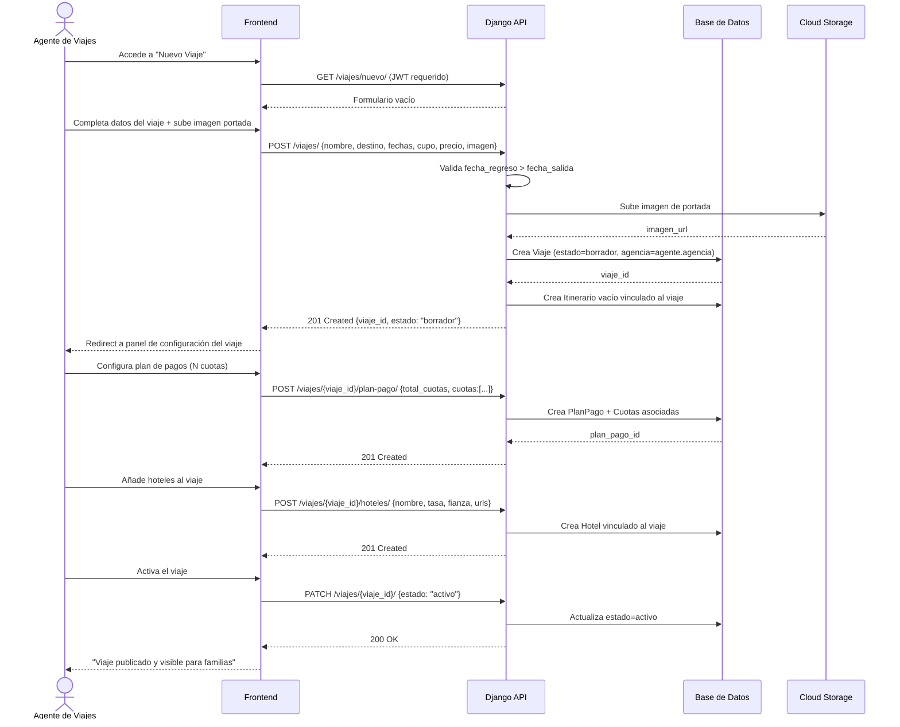

---

## FLOW 04 — Inscripción de Alumno (Padre/Tutor)

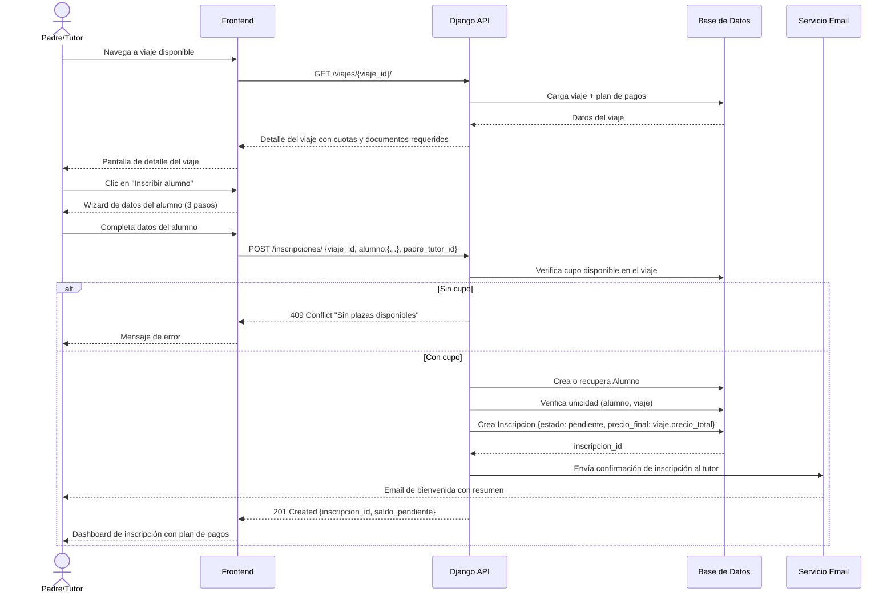

---

## FLOW 05 — Registro de Pago con Comprobante (Padre/Tutor)

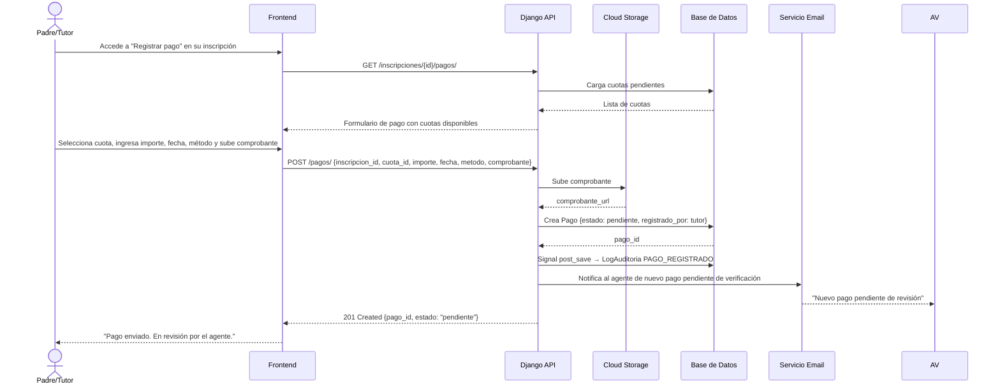

---

## FLOW 06 — Verificación de Pago (Agente)

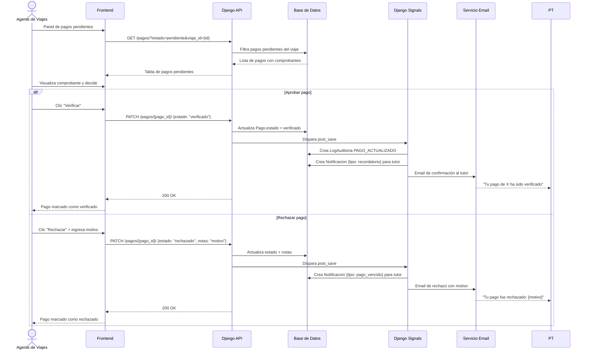

---

## FLOW 07 — Subida y Validación de Documentos

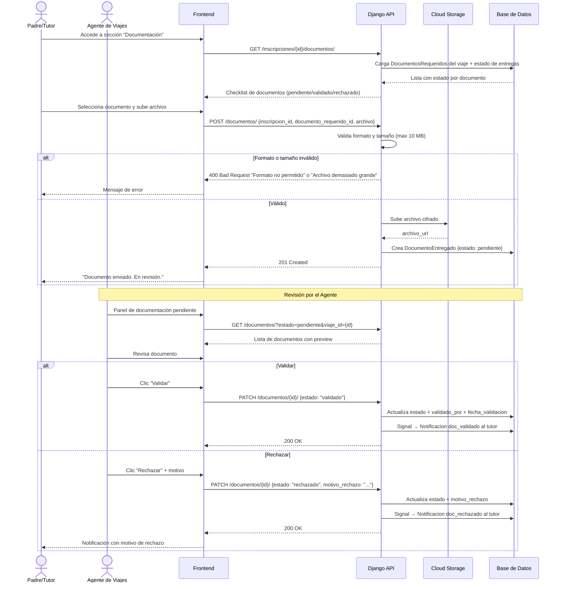

---

## FLOW 08 — Gestión de Itinerario (Agente)

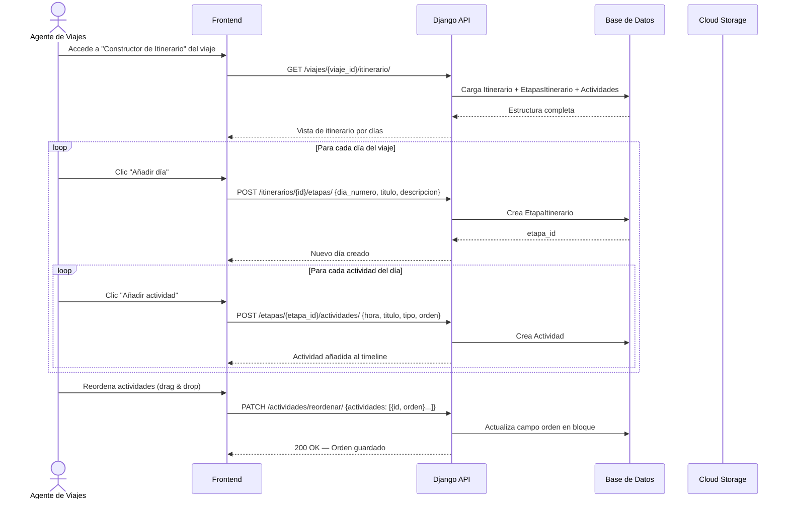

---

## FLOW 09 — Envío de Comunicado Masivo (Agente)

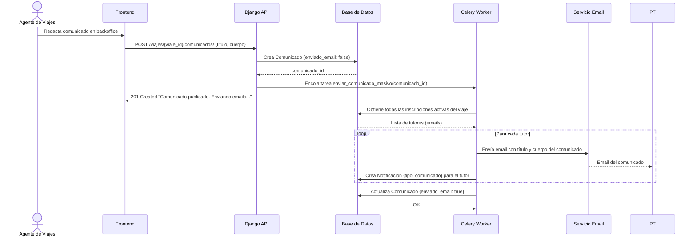

---

## FLOW 10 — Recordatorio Automático de Pago (Sistema/Celery)

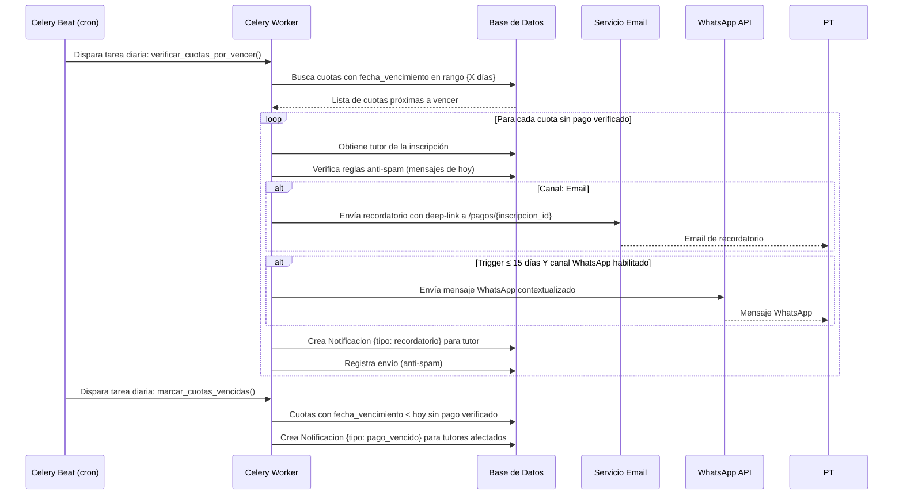

---

## FLOW 11 — Acceso del Mecenas y Pago en Nombre del Alumno

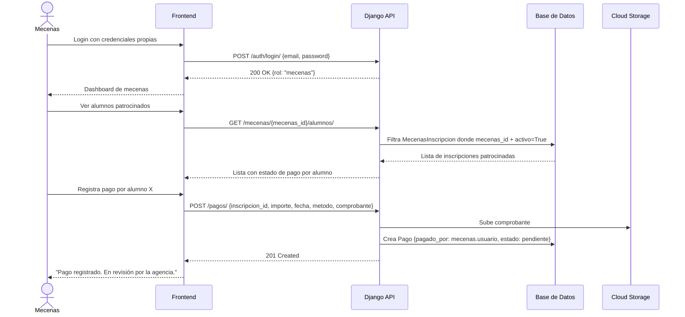

---

## FLOW 12 — Exportación y Reportes (Agente)

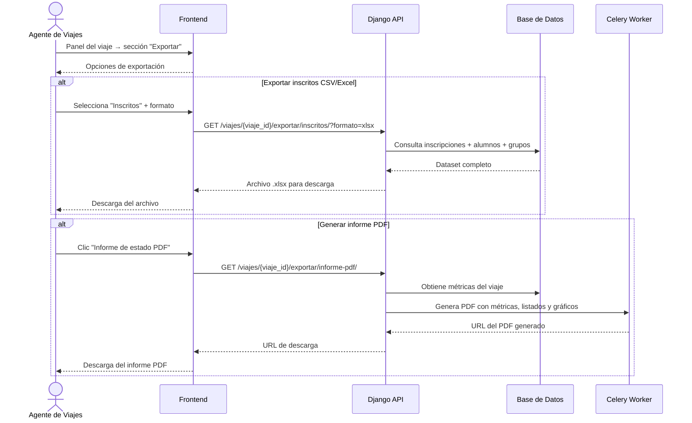

---

## Resumen de Customer Journey — Padre/Tutor

### Fases del Journey

| Fase | Nombre | Emoción principal |
|------|--------|------------------|
| 1 | Conciencia y Descubrimiento | 😃 Entusiasmo |
| 2 | Evaluación y Decisión | 🤔→😊 Confianza |
| 3 | Registro e Inscripción | 😐→😤→😌 |
| 4 | Gestión: Documentación | 😰→😤→😌 |
| 5 | Pagos | 😌 con alerta si hay vencidos |
| 6 | Preparación (pre-viaje) | 😊 Expectativa |
| 7 | Post-viaje | 😊 Satisfacción |

### Touchpoints por Fase

**Fase 1 — Conciencia:**
- Agencia envía link del viaje por WhatsApp o email
- Padre accede a la **landing pública** del viaje (`/viajes/{slug}/`)
- Landing incluye: Hero full-width, destino, fechas, plazas, precio desde, CTA "Inscribir a mi hij@"

**Fase 2 — Evaluación:**
- Revisa: licencia de agencia, seguro incluido, pago fraccionado, monitores, T&C
- Puntos de dolor: sin reseñas de padres, precio total no visible hasta avanzar

**Fase 3 — Registro:**
- Wizard de 3 pasos: Datos básicos → Centro educativo → Salud y T&C
- Búsqueda de viaje: por código directo o por centro educativo (provincia → colegio → destino)
- Validación inteligente: si el alumno no corresponde al nivel/colegio del viaje, se avisa

**Fase 4 — Documentación:**
- Dashboard muestra alerta con deep-link directo a `/documentos/{id}`
- Checklist visual con estados: Pendiente 🟡 / En revisión / Aprobado 🟢 / Rechazado 🔴
- Historial de versiones por documento (tras rechazos)

**Fase 5 — Pagos:**
- Plan de pagos con cuotas, fechas, estados
- Registro de pago manual + comprobante
- Recordatorios omnicanal automáticos (Celery)

**Estados del viaje comunicados al padre:**
- 🟠 Lista de espera → CTA: "Completar inscripción"
- 🟡 Pre-inscrito → CTA: "Ver qué falta"
- 🟢 Confirmado → CTA: "Ver detalles del viaje"
- 🔵 En camino → CTA: "Ver itinerario en vivo"

### Métricas Clave a Instrumentar

| Métrica | Fase |
|---------|------|
| Tasa de click en CTA "INSCRIBIR A MI HIJ@" | 1 |
| Tiempo en landing antes del primer click | 1 |
| Bounce rate de la landing | 1 |
| Tasa de completado del formulario paso 1 | 3 |
| Tasa de abandono en búsqueda de colegio/destino | 3 |
| Tiempo promedio para completar inscripción | 3 |
| % documentos aprobados antes de la fecha límite | 4 |
| Tasa de resubida tras rechazo | 4 |
| Tiempo promedio entre subida y aprobación | 4 |
| % de padres que completan todos los documentos a tiempo | 4 |
